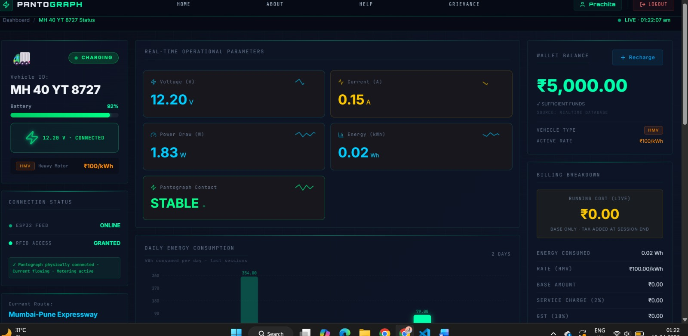
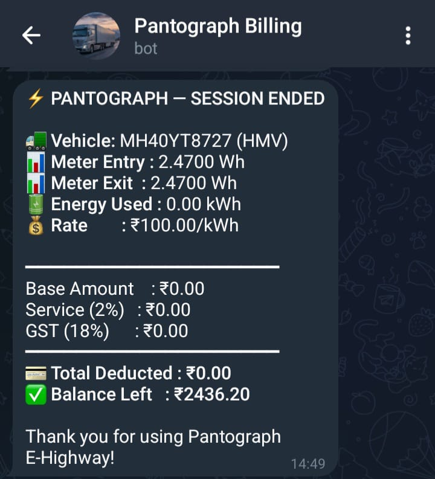
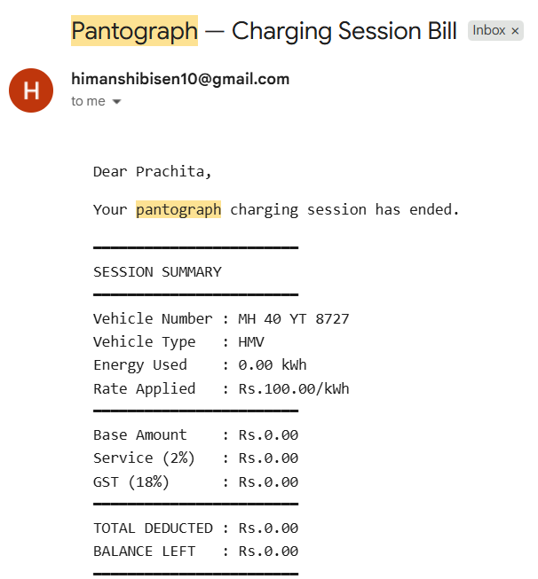
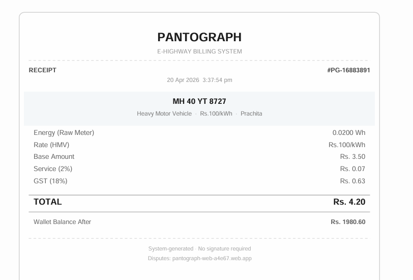
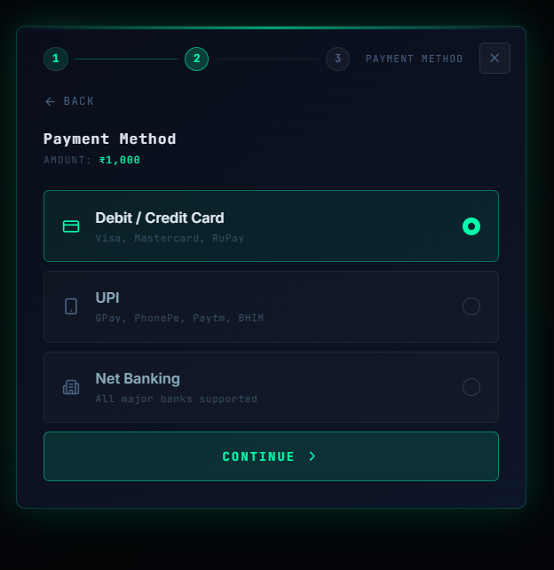
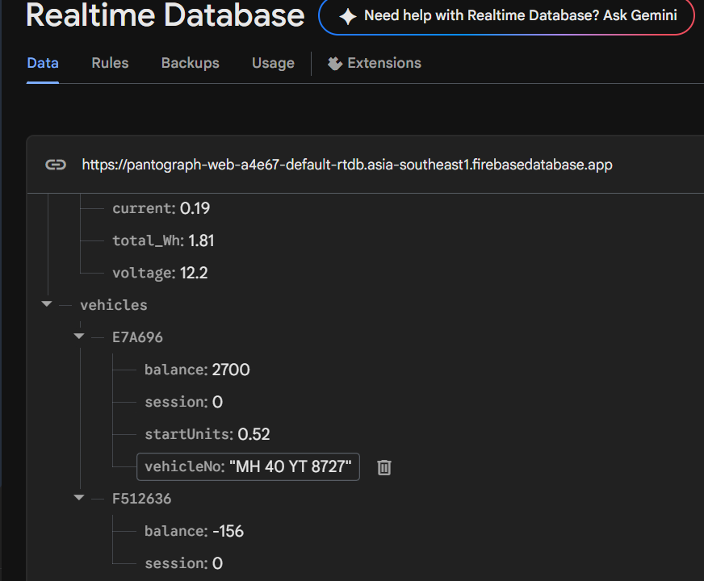
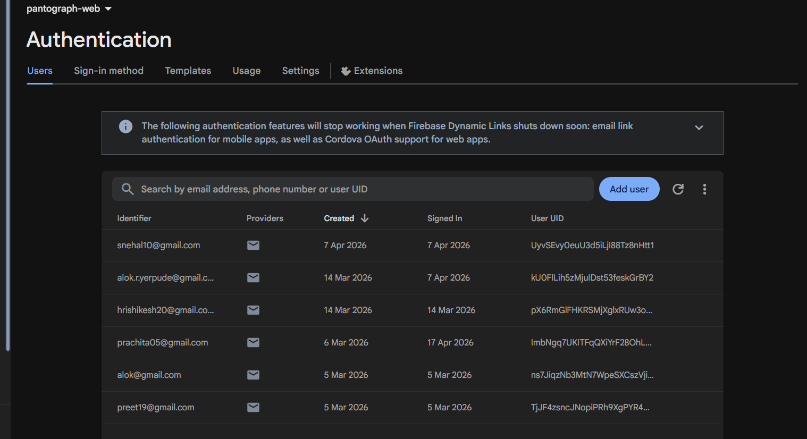
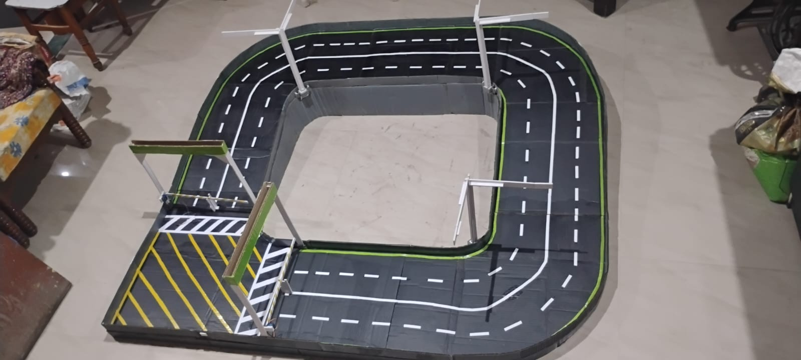
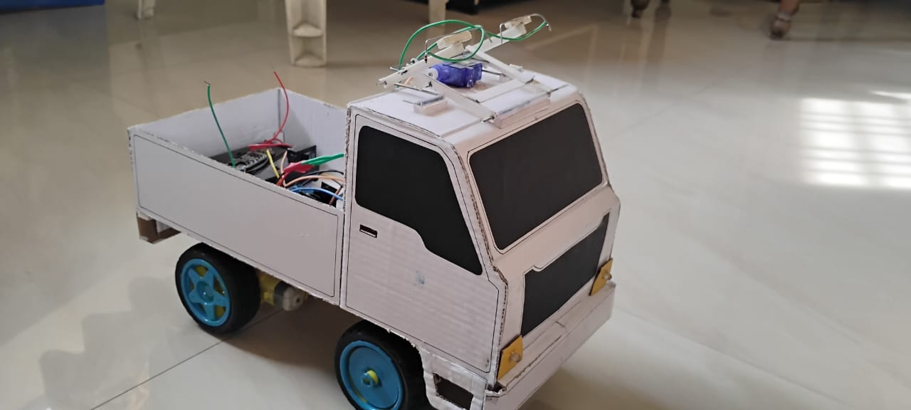

# ⚡ Pantograph Billing System

> IoT-enabled smart electric highway billing and monitoring system for pantograph-based electric trucks.

---

## 🚀 Features

- 🔋 Real-time energy monitoring
- ☁️ Firebase Realtime Database integration
- 🪪 RFID-based vehicle authentication
- 💳 Automated billing system
- 📩 Telegram & Email notifications
- 💰 Wallet recharge and payment system
- 📊 Smart dashboard analytics
- ⚡ Pantograph-based charging prototype

---

# 🖥️ Dashboard Preview

  

---

# 📲 Notification System

<table>
<tr>
<td align="center"><b>Telegram Alert</b></td>
<td align="center"><b>Email Invoice</b></td>
</tr>

<tr>
<td>

</td>

<td>

</td>
</tr>
</table>

---

# 💳 Billing & Payments

<table>
<tr>
<td align="center"><b>Billing Receipt</b></td>
<td align="center"><b>UPI Payment</b></td>
<td align="center"><b>Recharge Options</b></td>
</tr>

<tr>
<td>

</td>

<td>

</td>

<td>

</td>
</tr>
</table>

---

# ☁️ Firebase Integration

<table>
<tr>
<td align="center"><b>Realtime Database</b></td>
<td align="center"><b>Authentication</b></td>
</tr>

<tr>
<td>

</td>

<td>

</td>
</tr>
</table>

---

# 🚛 Hardware Prototype

<table>
<tr>
<td align="center"><b>Highway Prototype</b></td>
<td align="center"><b>Truck Model</b></td>
</tr>

<tr>
<td>

</td>

<td>

</td>
</tr>
</table>

---

# 🛠️ Tech Stack

## Frontend
- React.js
- JavaScript
- CSS

## Cloud & Backend
- Firebase Realtime Database
- Firebase Authentication
- EmailJS

## IoT & Hardware
- ESP32
- RFID Module
- INA219 Sensor
- Pantograph Charging Mechanism

---

# 👩‍💻 My Contribution

- Developed React dashboard UI
- Integrated Firebase realtime database
- Built automated billing workflow
- Implemented Telegram & Email notifications
- Worked on IoT-cloud communication
- Developed recharge and payment interfaces

---

# 🔮 Future Scope

- AI-based energy optimization
- Smart EV highway infrastructure
- Renewable energy integration
- Large-scale electric highway deployment

---

# ⭐ Project Highlights

✅ Real-time monitoring  
✅ Automated billing  
✅ IoT + Cloud integration  
✅ Hardware + Software implementation  
✅ Smart EV infrastructure prototype  